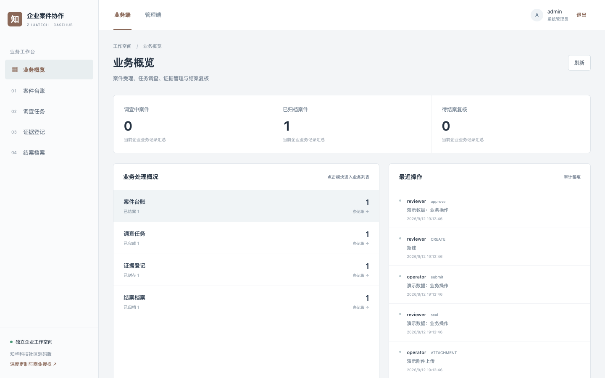
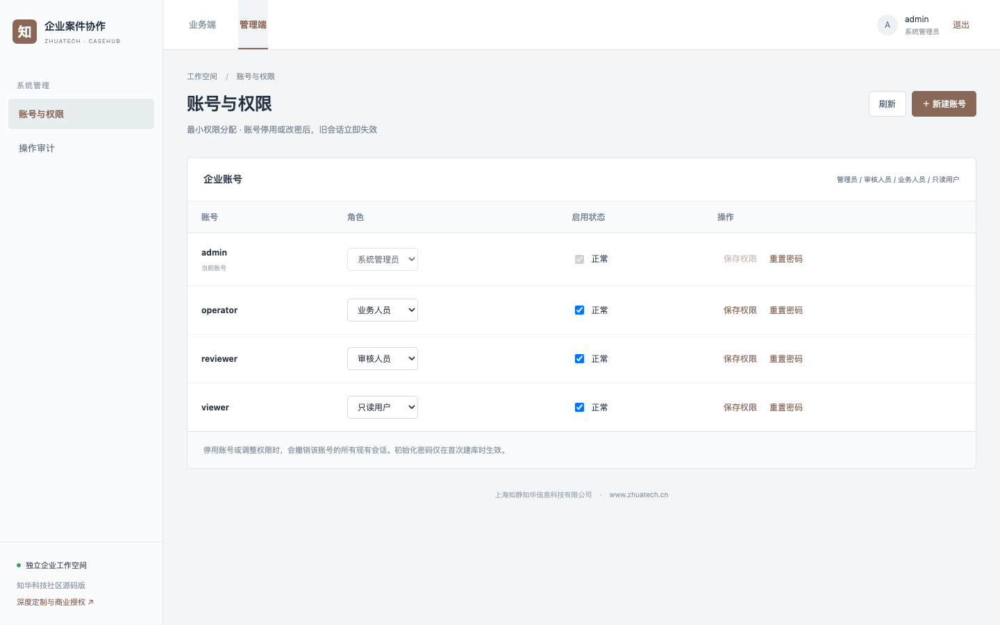
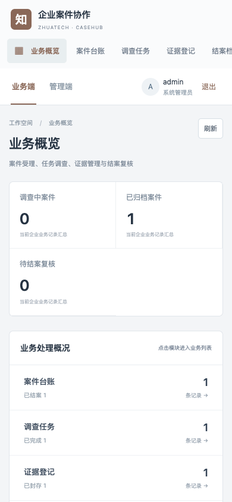

# zhuatech-casehub

## 知华企业案件协作

投诉、事故和合规事件往往散落在邮件和聊天记录里。上海如静知华信息科技有限公司的这一公开源码版把**受理、调查任务、证据、独立结案复核、归档**连接起来；每一步都有权限和审计约束。[知华科技官网](https://www.zhuatech.cn/)。

### 关键业务路径

| 阶段 | 系统实际执行 |
| --- | --- |
| 受理 | 建立案件编号、类别、报告人和严重级别。 |
| 调查 | 建立负责人和截止日明确的任务；在调查阶段登记证据。 |
| 证据交接与封存 | 证据新建时记录保管人；移交给本企业有效账号须填写唯一交接凭证与用途，逐笔形成交接链。只有当前保管人可追加附件或核验封存；封存时校验文件内容摘要和大小，封存后不能追加附件。 |
| 结案申请 | 全部任务完成且至少一份证据已封存、完整性校验通过，才允许提交处理结论。 |
| 复核归档 | 审核人员独立批准或退回；批准前再次校验封存证据，防止调查与审批之间发生静默篡改。 |



管理端账号与权限设置：



移动 H5 工作台：



业务端提供案件/任务/证据/结案档案与 H5 适配；管理端提供用户、权限和审计。附件限制大小及类型，下载必须登录。只读账号不能查看或下载 `CONFIDENTIAL` 证据附件；业务人员、审核人员及管理员可按职责访问。证据可通过只读接口 `GET /api/evidence/{id}/integrity` 检查封存清单与实际文件是否一致，损坏文件拒绝下载。请勿用演示模式存放真实敏感案件资料；生产需要单独完成保密分级、存储加密、留存期限及法务合规评估。

## 运行与验证

需要 Docker Compose。复制 `.env.example` 为 `.env`，分别设置 MySQL 与四种角色的独立强密码，然后执行：

```bash
docker compose up -d --build
sh scripts/test.sh
```

业务端与管理端共用 `http://127.0.0.1:8088`（管理入口 `/admin`）；后端健康检查为 `http://127.0.0.1:18080/api/health`。四个初始化账号为 `admin`、`reviewer`、`operator`、`viewer`，密码从环境变量读取。端口可通过 `WEB_PORT`、`API_PORT` 调整。可使用 `.env.demo.example` 做**仅本机**演示，但切勿连接真实业务数据库或向公网开放演示密码。

后端采用 Java 21 / Spring Boot 4 / MySQL 8.4 / Flyway；前端采用 Vue 3 / Vite，适配桌面与 H5。CI 在 MySQL 上运行后端测试；本机脚本默认用 H2 MySQL 兼容模式跑后端验收，再跑前端单测及生产构建。完整验收脚本见 `backend/src/test/resources/acceptance.json`。

## 使用边界与授权

本仓库是可运行的公开源码学习交流版本，**不是 OSI 意义的开源许可**。根据 [LICENSE](LICENSE)，源码仅限个人非商业学习、研究和交流。企业内部生产、客户交付、SaaS、收费服务及其他商用均须先取得上海如静知华信息科技有限公司书面授权。生产上线还需要企业自己的安全评估、备份恢复、合规与业务参数验收。

[知华科技官网](https://www.zhuatech.cn/)提供中小企业信息化、AI 转型、OPC 技术支持、软件项目外包、实施、FDE 外包与深度开发定制咨询。也可扫码添加微信咨询：

| 微信咨询一 | 微信咨询二 |
| --- | --- |
|  |  |

版权及项目维护：上海如静知华信息科技有限公司 · https://www.zhuatech.cn/
